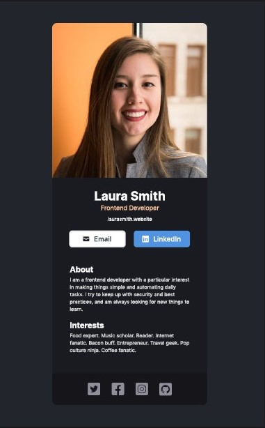

# FreeCodeCamp Solo Project
Learning React on FreeCodeCamp
this is the first project proposed by the teacher Bob Ziroll

## Business Card Mock

Visit [Business Card](https://fcc-business-card.netlify.app/) to see the project

### Requirements
- Build from scracth
- Fill my own information (I used the mock information)
- Separate components for:
    - Info (photo, name, buttons, etc.)
    - About
    - Interests
    - Footer (social icons)

